# AWS Well-Architected Web Application

Assessing and remediating a three-tier web application against four pillars of the AWS Well-Architected Framework — security, reliability, performance efficiency, and cost optimization — using load testing and CloudWatch observability.


---

## Overview

This project evaluates a production-style three-tier web application (presentation → logic → data tier) running on AWS EC2 behind an Application Load Balancer, and applies three principles of good data architecture: **prioritize security**, **plan for failure**, and **architect for scalability**.

The application was assessed and improved across four areas: identifying and closing a security misconfiguration, validating multi-AZ reliability, right-sizing compute for cost efficiency, and load-testing an auto scaling policy under simulated production traffic.

**Stack:** AWS EC2, Application Load Balancer, Auto Scaling Groups, CloudWatch, CloudShell, Apache Benchmark

---

## Architecture

Three-tier architecture: an S3-backed data tier, an EC2 Auto Scaling Group + ALB logic tier spanning two Availability Zones, and a client-facing presentation tier.

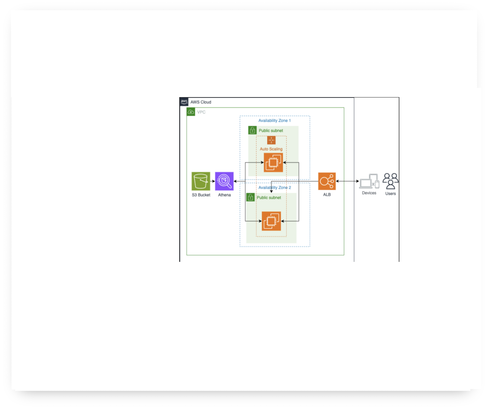

---

## 1. Security — Identifying and Closing an Open Port

**Problem found:** The ALB's security group allowed all TCP traffic (`0-65535`) from any source (`0.0.0.0/0`). This meant port 90, intended only for internal/private data, was publicly accessible.

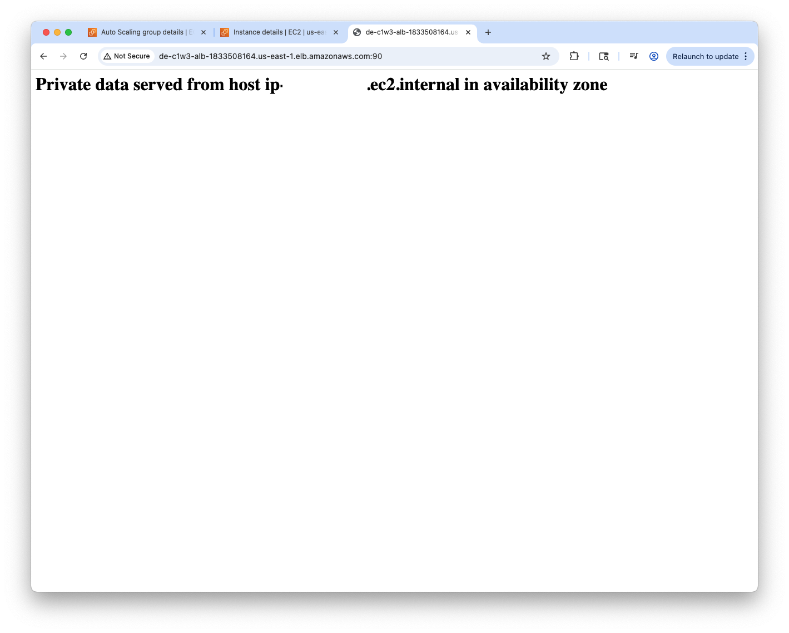

**Fix applied:** Added a restrictive inbound rule allowing only port 80 (standard HTTP) from `0.0.0.0/0`, then removed the original all-ports rule.

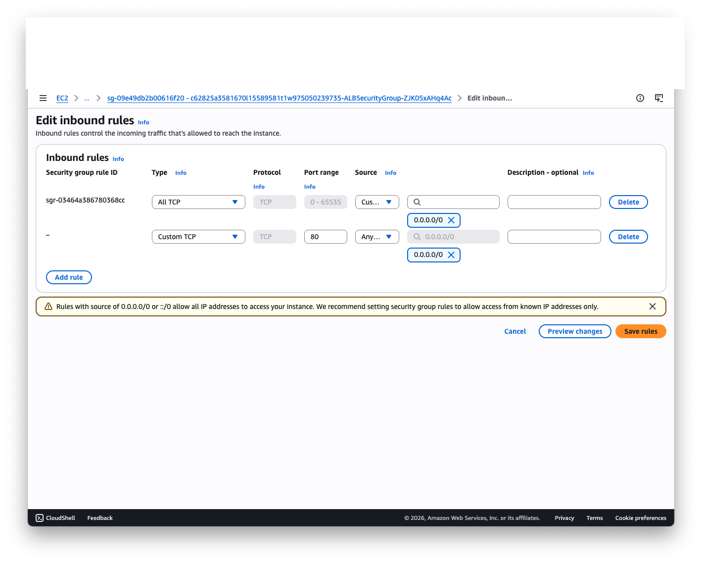

**Result verified:** Port 90 became unreachable, while the application continued serving correctly on port 80.

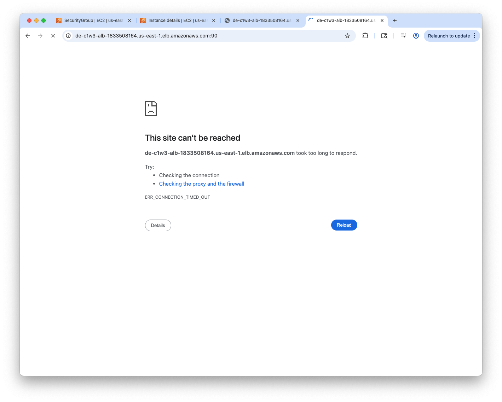
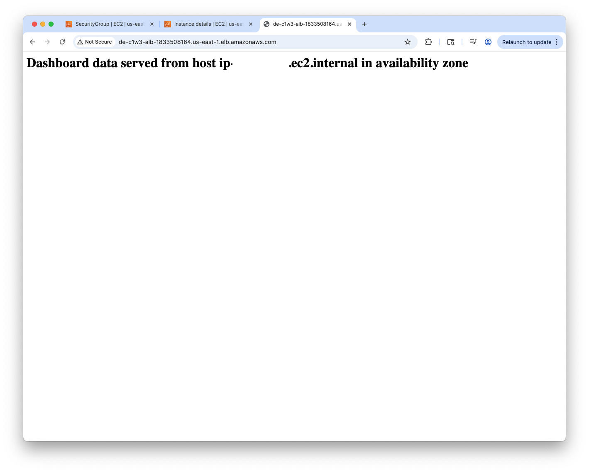

This maps to the **Security pillar** of the AWS Well-Architected Framework and the "Prioritize security" principle — restricting inbound access to only what the application requires.

---

## 2. Reliability — Multi-AZ Validation

The Auto Scaling Group is configured across two Availability Zones (`us-east-1a`, `us-east-1b`). Refreshing the application repeatedly confirmed requests were served from different EC2 instances and AZs, validating that a single-AZ failure would not take the application down.

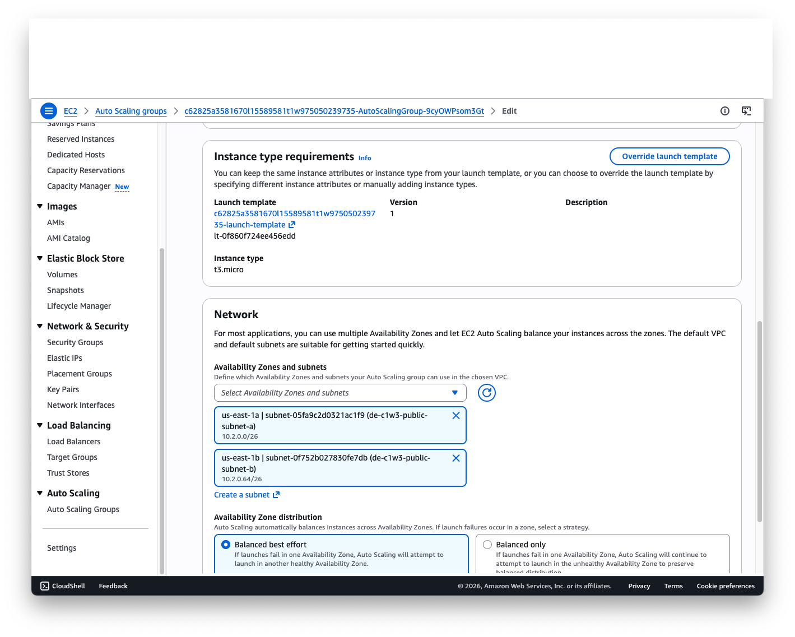

This reflects the **Reliability pillar** and the "Plan for failure" principle — designing for fault isolation rather than relying on a single point of infrastructure.

---

## 3. Cost Optimization — Right-Sizing Compute

The original instances (`t3.micro`) were over-provisioned for the application's actual load. I created a new Launch Template version specifying `t3.nano`, applied it to the Auto Scaling Group, and terminated the existing instances to force replacement with the right-sized type.

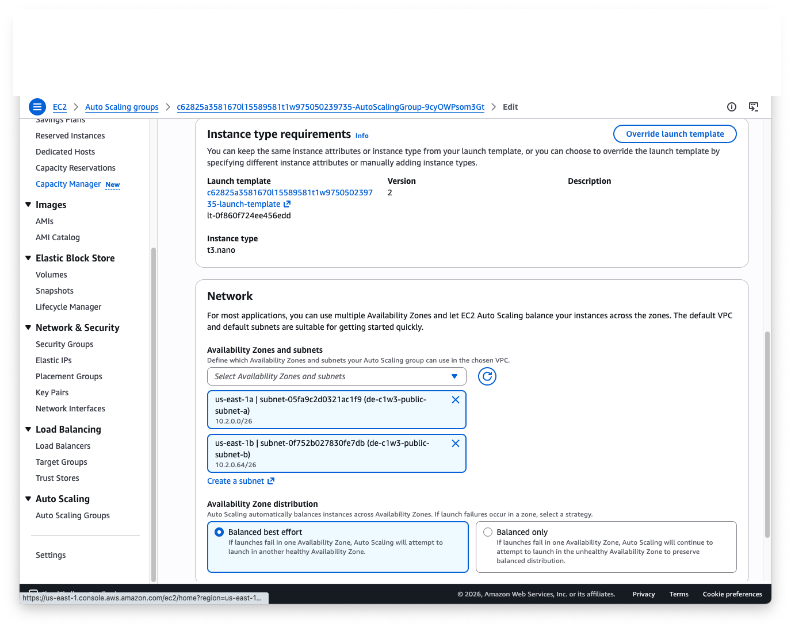
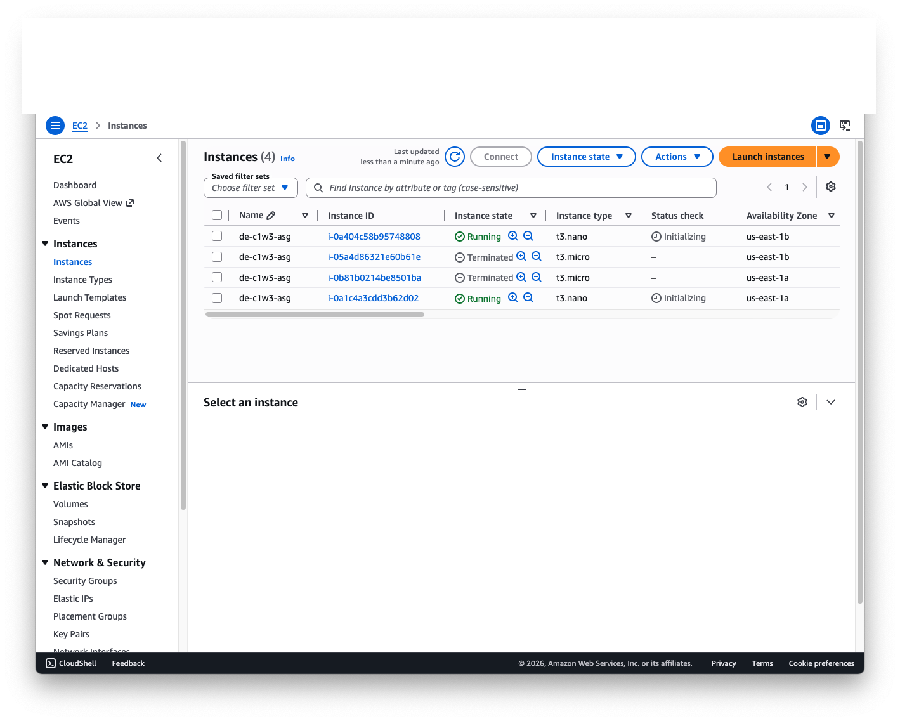

This reflects the **Cost Optimization pillar** and FinOps practice — matching compute capacity to actual demand rather than over-provisioning by default.

---

## 4. Scalability — Auto Scaling Under Load

Configured a target-tracking scaling policy (`de-c1w3-scaling-policy`) to scale the Auto Scaling Group based on ALB request count per target, with a threshold of 60 requests and a 60-second instance warm-up.

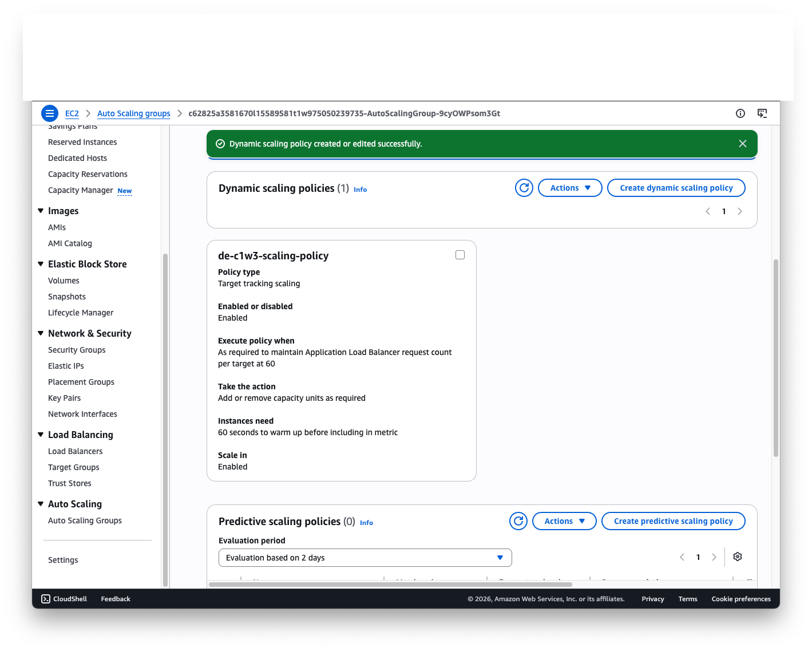

**Load test:** Used Apache Benchmark to simulate 1,000,000 HTTP requests at a concurrency of 200 against the ALB.

```
Complete requests:      1,000,000
Failed requests:        3
Requests per second:    7,929.01 [#/sec] (mean)
Time per request:       25.224 ms (mean)
99th percentile latency: 81 ms
Total time:              126.1 seconds
```
Because `t3.nano` is a burstable instance type, CPU credit usage and balance were also monitored during the load test to confirm the instances weren't being CPU-throttled under sustained load.


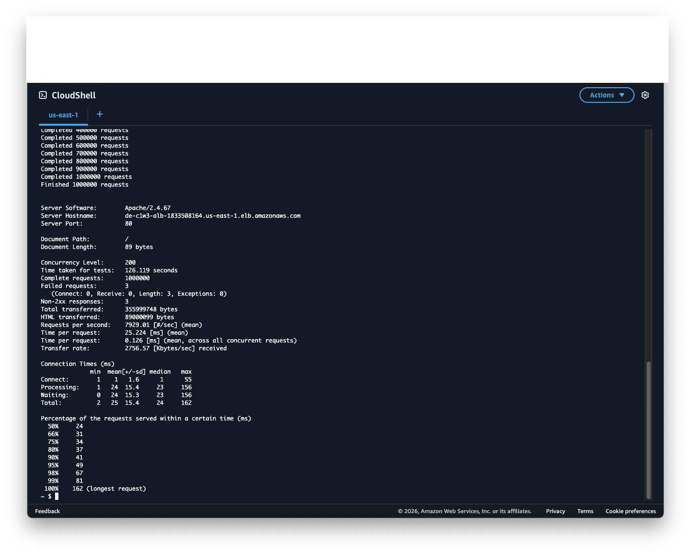

**Observed scaling behavior:** CPU utilization and network throughput spiked during the test, and the Auto Scaling Group automatically launched additional EC2 instances to absorb the load, then terminated them as demand subsided.

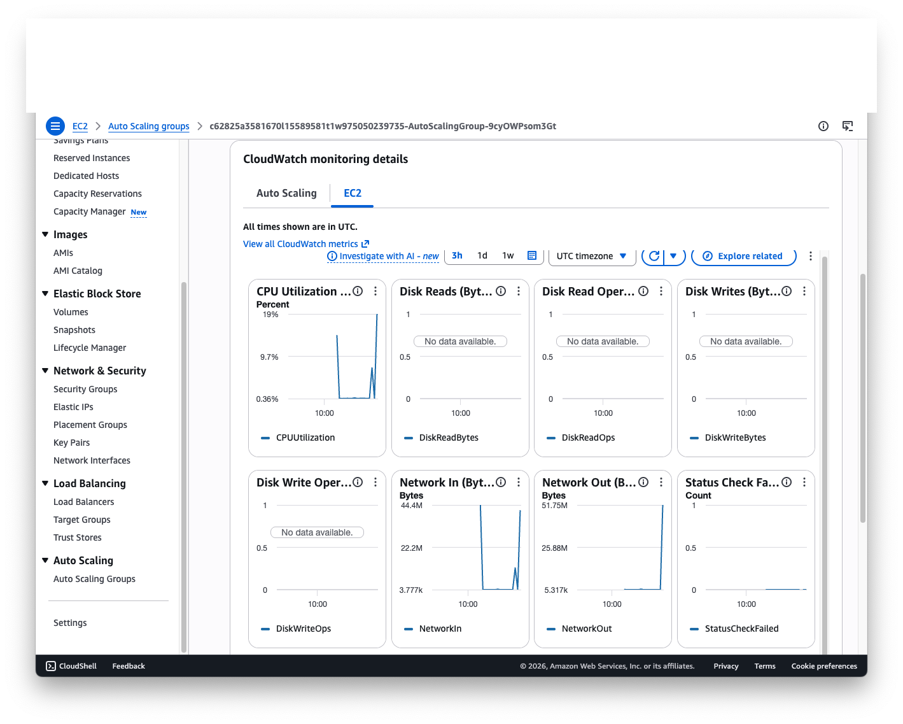
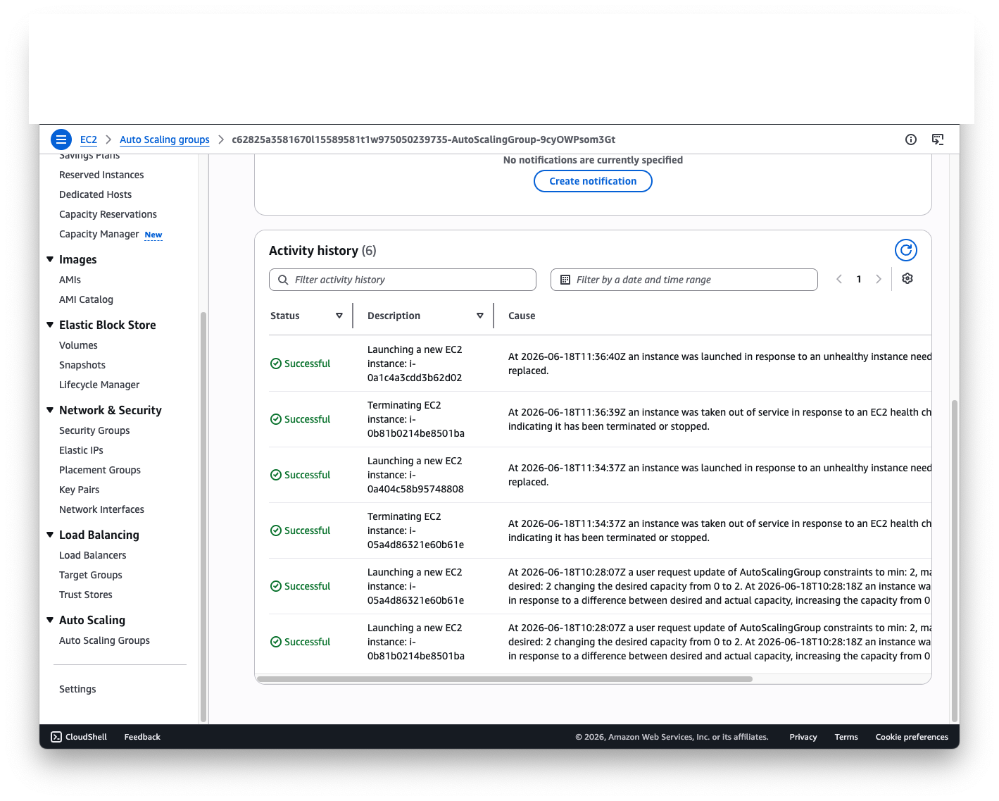

This reflects the **Performance Efficiency** and **Reliability pillars**, and the "Architect for scalability" principle — the system absorbed a 1M-request load at ~7,900 req/sec with a 99th-percentile latency of 81ms and a 0.0003% failure rate, while automatically adjusting capacity.

---

## What I'd Build Next

If extending this into a production-grade system, I would:

- Add a Web Application Firewall (WAF) in front of the ALB for layer-7 protection (rate limiting, IP reputation filtering) rather than relying on security groups alone
- Replace the fixed request-count threshold with a custom CloudWatch metric combining CPU and request latency for more accurate scaling decisions
- Add CloudWatch Alarms with SNS notifications for failed health checks, rather than relying on manual monitoring
- Extend to a multi-region active-passive setup for disaster recovery beyond multi-AZ
- Introduce Infrastructure as Code (Terraform) to version-control the security group, scaling policy, and launch template changes made manually in this lab

---

## Context

Completed as part of the **DeepLearning.AI Data Engineering Professional Certificate**, "Good Data Architecture." Lab infrastructure (VPC, ALB, Auto Scaling Group) was pre-provisioned; the security remediation, cost optimization, scaling policy configuration, load testing, and all analysis above were performed independently.